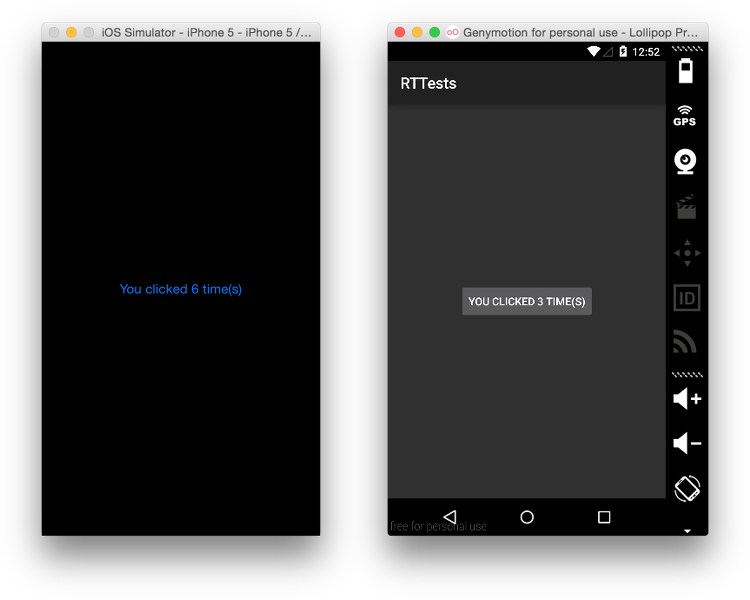

# Counter

Our next goal is to get our app respond to events and update the UI.

First of all let’s remove the need to import the elements we use.

With *react-titanium* is provided a *Babel plugin* that analyzes your code on the go and automatically imports the used tagnames.

Configure the plugin in you *package.json*:

    // package.json
    {
      // ...
      "titaniumifier": {
        "transforms": {
          "babelify": {
            "stage": 0,
            "optional": [ "runtime" ],
            "plugins": [
              "react-titanium/lib/babel-plugin:before"
            ]
          }
        }
      }
      // ...
    }

This way we are telling Babel to pass through `react-titanium/lib/babel-plugin` **before** the standard ones.

We can then move the actual code:

```js
// Resources/app.js

import React, { Component } from 'react';
import { render } from 'react-titanium';

class App extends Component {
  getInitialState() {
    return { count: 0 };
  }

  incrementCounter(event) {
    this.setState({
      count: this.state.count + 1
    });
  }

  render() {
    return (
      <window ref="window">
        <button onClick={ this.incrementCounter.bind(this) }>
          You clicked {this.state.count} time(s)
        </button>
      </window>
    );
  }

  componentDidMount() {
    this.refs.window.open();
  }
}

render(<App />);

```

Run it on iOS with:

    titanium build --platform ios --tall

And on Android with:

    titanium build --platform android

And you should get something along the lines of this screenshot:



## Next steps

If you to better understand what happened, head to the [explanation](Explanation.md).

If you want to see how it compares to other frameworks, there’s a [comparison page](Comparison.md).
